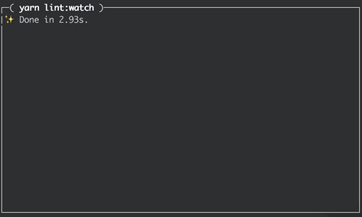

Clrscr
===

A simple cross-plateform utility to clear a CLI screen in JavaScript (equivalent to Ctrl+r on Linux or Mac).

# Why ?

When I ran my projet in watch mode to develop on it, I didn't give a shit on the previous logs of a webpack, an eslint (or other tools like that). So, I needed a way to clearify screen. I didn't find tool which do that correclty so I wrote my own.

# Usage

To install it (for development), as usual, just tap :
On Yarn : `yarn add clear-screen --dev`
On NNPm : `npm i --save-dev clear-screen`

Then, you can call it from yours NPM scripts.
For example, if you want watch your files and fire a linting after each change without having the logs of the previous version, you could write this in your **package.json**.

```
{
  "name": "My-project",
  "scripts": {
    "lint": "clear-screen && eslint ./src",
    "lint:watch": "watch 'yarn lint' ./src"
  }
}
```

If you run `yarn lint:watch` (ou `npm run lint:watch`) you will see that :


> You can use to `clr` instead of `clear-screen` to be more concise.

# Credit

This module is strongly inspired of how [Jest](https://facebook.github.io/jest/) (the famous Unit test Framework) cleans the screen before each run.